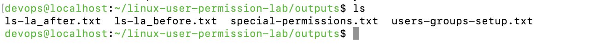
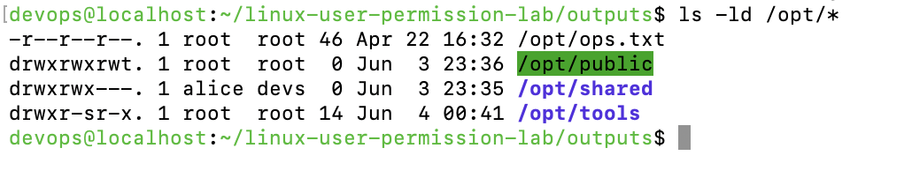
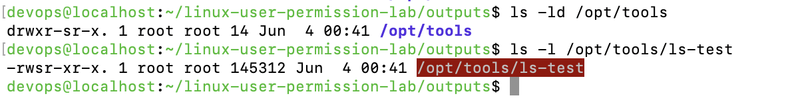
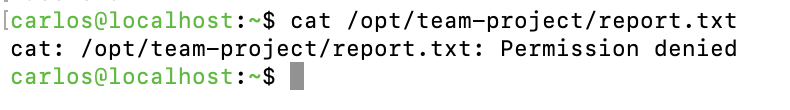
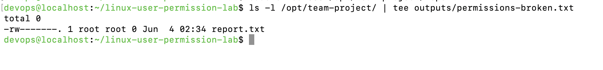
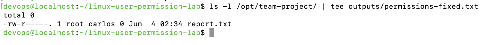

# Linux User & Permission Lab 🛡️
_A hands-on lab project to demonstrate Linux user, group, permission, and ACL management._

---

## 📌 Objective

This lab replicates real-world tasks for managing users, permissions, and file access in Linux. It reinforces core concepts from the **CompTIA Linux+ (XK0-005)** certification.

---

## 🧠 Skills Demonstrated

- Create and manage Linux users and groups
- Modify file and directory ownership with `chown`
- Set and analyze permissions with `chmod` and special bits (`setuid`, `setgid`, `sticky`)
- Apply and view Access Control Lists (ACLs)
- Troubleshoot permission-related issues
- Automate using basic shell scripts

---

## 🖥️ Environment

- OS: Fedora 41 (or other Linux distro)
- Shell: Bash
- Users created: `alice`, `bob`, `guest`
- Groups created: `devs`, `guests`

---

## 🔧 Tasks Performed

### 👤 User & Group Management

```bash
sudo useradd alice
sudo useradd bob
sudo groupadd devs
sudo usermod -aG devs alice
```

---

### 📸 Screenshots

🗂️ **Project Output Folder**
Shows the log files captured during this lab (before/after permissions, special bits).


📸 **Permissions Before vs After**
Demonstrates the change from incorrect to correct permissions on `/opt/shared` and `/opt/public`.


📸 **Special Permissions Applied**
Confirms `SetUID`, `SetGID`, and sticky bit were correctly applied and verified.


---

## 🔐 ACLs – Access Control Lists

In enterprise environments, Access Control Lists (ACLs) provide **fine-grained permissions** beyond standard Unix user/group ownership, allowing specific users to access files or directories without altering ownership.

### 🎯 Objective

Grant user `bob` full access (`rwx`) to the `/opt/projects` directory **without changing ownership or group**, using `setfacl`.

---

### 🛠️ Commands Executed

```bash
# Create the projects directory
sudo mkdir -p /opt/projects

# Verify default ownership and permissions
ls -ld /opt/projects

# Grant rwx permissions to bob using ACL
sudo setfacl -m u:bob:rwx /opt/projects

# Confirm ACL and export to file
getfacl /opt/projects > outputs/getfacl-output.txt

# [Optional] Test Bob's access
sudo -u bob touch /opt/projects/testfile_by_bob
ls -l /opt/projects/testfile_by_bob
```

---

---

## 🧪 Troubleshooting Real-World Permission Errors

### 🎯 Objective

Simulate and troubleshoot permission errors in a collaborative directory (`/opt/team-project`) where a user (`carlos`) cannot access or edit files owned by `root`. This replicates real-world DevOps and system administration scenarios.

---

### 🛠️ Actions Performed

1. Created directory `/opt/team-project`
2. Created file `report.txt` as `root`
3. Tried accessing/modifying the file as user `carlos`
4. Received a `Permission denied` error — proving access misconfiguration
5. Collected broken permission output → `outputs/permissions-broken.txt`
6. Applied correct group ownership and permissions:
   - Group: `carlos`
   - File permissions: `chmod 640 report.txt`
   - Directory permissions: `chmod 770 /opt/team-project`
7. Verified successful access
8. Collected corrected permission output → `outputs/permissions-fixed.txt`

---

### 📄 Output Logs

- `outputs/permissions-broken.txt` – Before fixing permissions (contains the `Permission denied` error)  
- `outputs/permissions-fixed.txt` – After fixing permissions

---

### 📸 Screenshots

- **Access Denied Output**
  

- **Permission Error (Broken)**
  

- **Permissions Corrected (Fixed)**
  

---
